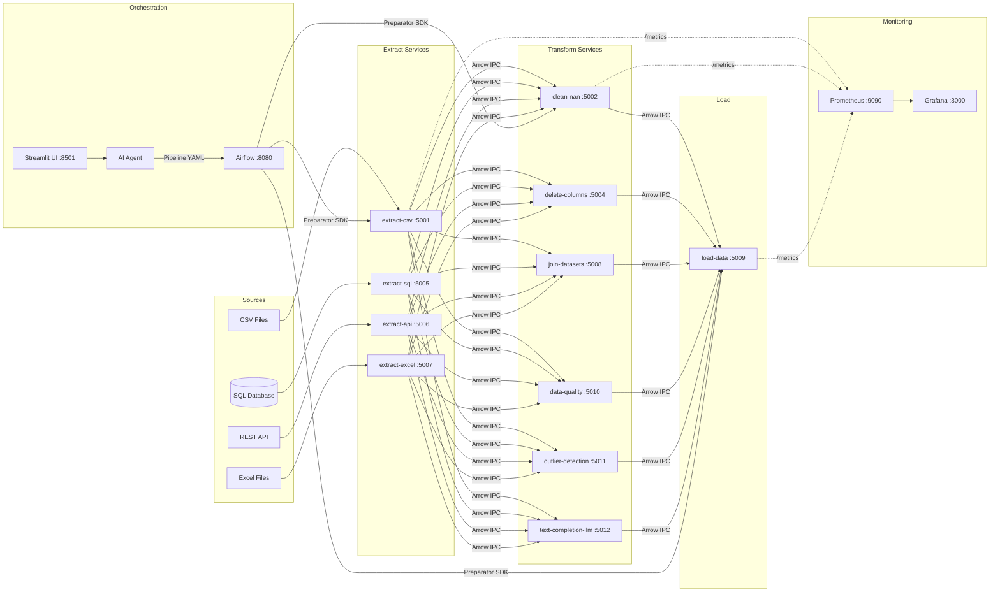

# ArrowFlow

[](https://github.com/VTvito/arrowflow/actions/workflows/ci.yml)
[](https://www.python.org/downloads/)
[](LICENSE)
[](docker-compose.yml)

**Build ETL pipelines by describing them in plain English.** ArrowFlow is a modular platform where each data operation (extract, transform, load) is an independent microservice. An AI agent translates natural language into executable pipeline definitions, validated and run automatically.

> *"Load the HR dataset, remove salary outliers, fill missing values with the median, and save as Parquet"*
> &mdash; That's all it takes. The AI agent generates a YAML pipeline, validates it, and executes it across the services.

---

## Key Features

- **Natural Language Pipelines** &mdash; Describe what you need in plain text; the AI agent generates and executes a validated YAML pipeline
- **11 Composable Services** &mdash; Extract (CSV, SQL, API, Excel), Transform (clean, filter, join, quality checks, outlier detection, LLM), Load (CSV, Excel, JSON, Parquet)
- **High-Performance Data Transfer** &mdash; Apache Arrow IPC binary format between all services (zero-copy, no CSV/JSON parsing overhead)
- **Visual Pipeline Builder** &mdash; Streamlit UI with YAML editor, platform readiness checks, one-click Airflow triggers, real-time execution monitor, dataset explorer (browse outputs, preview, download), and service catalog
- **Airflow Orchestration** &mdash; Production-ready DAGs with file-based XCom for large datasets
- **Full Observability** &mdash; Prometheus metrics + Grafana dashboards + structured JSON logging + correlation ID tracing
- **Extensible** &mdash; Add a new service in minutes using the included scaffold template and step-by-step guide

---

## Quick Start

### Prerequisites

- [Docker Desktop](https://www.docker.com/products/docker-desktop/) (with Docker Compose)
- Python 3.9+ (for local development and tests)

### Setup

```bash
git clone https://github.com/VTvito/arrowflow.git
cd arrowflow
make quickstart
```

This will build all images, start 18 containers, and load the demo datasets.
The Airflow admin user (`admin`/`admin`) is created automatically on first boot.

### Open the UIs

| Interface | URL | Credentials |
|---|---|---|
| **Streamlit** (Pipeline Builder + Dataset Explorer) | http://localhost:8501 | &mdash; |
| **Airflow** | http://localhost:8080 | admin / admin |
| **Grafana** (pre-provisioned dashboard) | http://localhost:3000 | admin / *GF_SECURITY_ADMIN_PASSWORD from .env* |
| **Prometheus** | http://localhost:9090 | &mdash; |
| **cAdvisor** (container resources) | http://localhost:8088 | &mdash; |

### Try a Demo Pipeline

Trigger one of the pre-built DAGs from the Airflow UI:

| DAG | What it does |
|---|---|
| `hr_analytics_pipeline` | HR data &rarr; quality check &rarr; drop columns &rarr; outlier detection &rarr; clean nulls &rarr; save |
| `ecommerce_pipeline` | E-commerce orders &rarr; quality &rarr; outlier detection &rarr; fill nulls &rarr; save |
| `weather_api_pipeline` | Live weather API (Open-Meteo, no key needed) &rarr; quality &rarr; clean &rarr; save as Parquet |

Or paste a YAML from [`examples/pipelines/`](examples/pipelines/) into the Streamlit YAML Editor.

After execution, switch to the **Datasets** tab to browse output files, preview data, download results, and compare the latest run against the previous successful run.

### New in Streamlit UX

- **Platform Readiness** panel in Execution tab: live checks for Airflow, Streamlit, Prometheus, Grafana, including Airflow scheduler heartbeat status
- **Quick Airflow Triggers** in Execution tab: trigger `hr_analytics_pipeline`, `ecommerce_pipeline`, or `weather_api_pipeline` without leaving Streamlit
- **Execution insights**: successful steps, processed data volume, slowest step, and orchestration overhead (%)
- **Run diagnostics** in Datasets tab: per-run active processing vs queue/orchestration gap timeline
- **Run Comparison** in Datasets tab: current run vs previous successful run deltas for duration, final rows, and removed outliers
- **Business KPI snapshot** from latest output file (domain-aware: HR, e-commerce, weather, or generic completeness)

---

## How It Works

```
User: "Load the HR dataset, check quality, remove salary outliers, and save as Excel"
  ↓
AI Agent → generates YAML pipeline definition
  ↓
Validator → checks services, parameters, dependencies
  ↓
Pipeline Compiler → executes steps in parallel via Preparator SDK
  ↓
Output: cleaned dataset saved in the requested format
```

The AI agent supports both **OpenAI** (GPT-4o-mini) and **local HuggingFace** models. The YAML editor and validator work without any API key.

---

## Architecture



All data flows between services as **Apache Arrow IPC** &mdash; a columnar binary format that avoids the overhead of CSV/JSON serialization.

### Services

| Category | Service | Port | Description |
|---|---|---|---|
| **Extract** | `extract-csv-service` | 5001 | Reads CSV files from the shared volume |
| | `extract-sql-service` | 5005 | Executes read-only SQL queries via SQLAlchemy |
| | `extract-api-service` | 5006 | Fetches data from REST APIs (supports auth) |
| | `extract-excel-service` | 5007 | Reads .xls/.xlsx files |
| **Transform** | `clean-nan-service` | 5002 | Handles nulls (drop, fill mean/median/mode/value, ffill, bfill) |
| | `delete-columns-service` | 5004 | Removes specified columns |
| | `join-datasets-service` | 5008 | Joins two datasets (inner/left/right/outer) |
| | `data-quality-service` | 5010 | Validates data quality rules (null ratio, duplicates, types, ranges, completeness) |
| | `outlier-detection-service` | 5011 | Z-score based outlier detection and removal |
| | `text-completion-llm-service` | 5012 | LLM text generation via HuggingFace |
| **Load** | `load-data-service` | 5009 | Saves data as CSV, Excel, JSON, or Parquet |

Every service also exposes `GET /health` (health check) and `GET /metrics` (Prometheus counters).

---

## Use Cases

### HR People Analytics

A 6-step pipeline for the IBM HR Attrition dataset (demo data included):

**Extract CSV &rarr; Data Quality &rarr; Drop Columns &rarr; Outlier Detection &rarr; Clean NaN &rarr; Load**

The DAG supports parameterized dataset name, output format, z-score threshold, and file-based XCom for large datasets.

### E-commerce Order Analytics

Price validation and cleanup for e-commerce order data (demo data included):

**Extract CSV &rarr; Data Quality + Completeness &rarr; Outlier Detection &rarr; Fill NaN (median) &rarr; Load as Parquet**

### Live Weather Data

Demonstrates the API extraction service with live data (no API key required):

**Extract API (Open-Meteo) &rarr; Data Quality &rarr; Clean NaN (forward fill) &rarr; Load as Parquet**

### Example Pipeline YAMLs

Ready-to-use definitions in [`examples/pipelines/`](examples/pipelines/):
- [`hr_analytics.yaml`](examples/pipelines/hr_analytics.yaml) &mdash; HR analytics (6 steps)
- [`ecommerce_analytics.yaml`](examples/pipelines/ecommerce_analytics.yaml) &mdash; E-commerce orders (5 steps)
- [`weather_data.yaml`](examples/pipelines/weather_data.yaml) &mdash; Weather API (4 steps)

---

## Benchmark

Compare microservices vs monolithic (pure Pandas) performance:

```bash
make benchmark-data    # Generate datasets (1k–500k rows)
make benchmark-all     # Run both approaches + generate charts
```

Results including PNG charts and an interactive Plotly report are saved to `benchmark/results/`.

---

## Development

### Testing

```bash
make test              # Run all tests (unit + integration)
make test-coverage     # With coverage report
make lint              # Ruff linter
```

### Adding a New Service

Copy the scaffold template and follow the guide:

```bash
cp -r templates/new_service services/my-service
# Replace placeholders, implement logic, register, build
```

Full walkthrough: [docs/extending.md](docs/extending.md)

### Documentation

| Doc | Contents |
|---|---|
| [docs/demo-guide.md](docs/demo-guide.md) | Step-by-step demo: UI, YAML editor, SDK, Airflow |
| [docs/architecture.md](docs/architecture.md) | System design, Arrow IPC, parallelism, Gunicorn, security |
| [docs/access-credentials.md](docs/access-credentials.md) | All service URLs, credentials, env vars |

### Project Structure

<details>
<summary>Click to expand</summary>

```
├── docker-compose.yml          # Full stack (18 containers)
├── Makefile                    # Common commands
├── data/demo/                  # Bundled demo datasets
│   ├── hr_sample.csv
│   └── ecommerce_orders.csv
├── examples/pipelines/         # Ready-to-use YAML pipelines
├── templates/new_service/      # Service scaffold template
├── docs/extending.md           # Extension guide
├── airflow/dags/               # Airflow DAG definitions
├── preparator/                 # Client SDK + service registry
├── services/
│   ├── common/                 # Shared utilities (Arrow, logging, health, metrics)
│   └── <service-name>/         # Each service: Dockerfile, run.py, app/
├── ai_agent/                   # LLM provider, pipeline agent, compiler
├── streamlit_app/              # Streamlit UI
├── schemas/                    # JSON Schema + service registry
├── benchmark/                  # Performance comparison tools
├── tests/                      # 17 unit + 2 integration test files
└── prometheus/                 # Scrape configuration
```

</details>

### Key Conventions

- **Business logic isolation** &mdash; HTTP/Flask code in `routes.py`, pure data logic in separate modules
- **Arrow IPC everywhere** &mdash; No CSV/JSON for inter-service data transfer
- **X-Params header** &mdash; JSON-encoded parameters for transform/load services
- **Correlation ID tracing** &mdash; `X-Correlation-ID` propagated end-to-end across all services
- **Structured JSON logging** &mdash; Consistent single-line JSON output with service, correlation_id, dataset_name

### Security

- Dataset names validated and constrained to safe characters; file paths resolved under `/app/data` only
- SQL extraction accepts only read-only queries (`SELECT`/`WITH`), blocks dangerous keywords, redacts credentials
- API extraction validates URL scheme/host and blocks private network targets by default (SSRF mitigation)

---

## Configuration

| Variable | Default | Description |
|---|---|---|
| `LLM_PROVIDER` | `openai` | AI agent provider (`openai` or `local`) |
| `OPENAI_API_KEY` | &mdash; | Required if `LLM_PROVIDER=openai` |
| `OPENAI_MODEL` | `gpt-4o-mini` | OpenAI model |
| `ETL_DATA_ROOT` | `/app/data` | Base directory for datasets and metadata |
| `ALLOW_PRIVATE_API_URLS` | `false` | Allow private/local API targets in extract-api |

See [`.env.example`](.env.example) for all available variables including database and monitoring credentials.

---

## Technology Stack

| Layer | Technology |
|---|---|
| Microservices | Python 3.9, Flask, Gunicorn |
| Data Format | Apache Arrow IPC (streaming) |
| Orchestration | Apache Airflow |
| AI Agent | OpenAI / HuggingFace Transformers |
| UI | Streamlit |
| Containers | Docker, Docker Compose (PostgreSQL 16, Airflow 2.10.4) |
| Monitoring | Prometheus + Grafana |
| Testing | pytest, ruff |
| CI/CD | GitHub Actions |

---

## License

MIT
