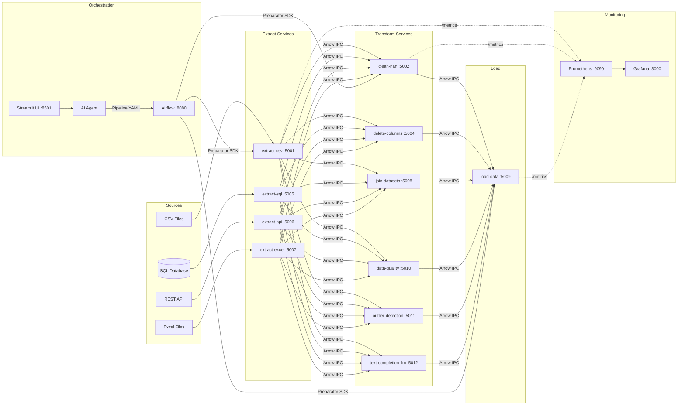

# ETL Microservices Platform

A modular, **AI-assisted ETL (Extract, Transform, Load) platform** built with a microservices architecture. Each ETL operation is an independent Flask-based microservice, orchestrated via Apache Airflow DAGs. The platform uses **Apache Arrow IPC** as the wire format for high-performance binary data interchange between services.

An integrated **Streamlit UI + AI Agent** allows users to describe pipelines in natural language and have them automatically generated, validated, and executed.

---

## Architecture



### Data Flow

All inter-service data flows as **Apache Arrow IPC streaming format** — a zero-copy columnar binary format that eliminates CSV/JSON parsing overhead.

| Pattern | Used By | Request | Response |
|---|---|---|---|
| JSON → Arrow IPC | Extract services | JSON body (config) | Arrow IPC binary |
| Arrow IPC → Arrow IPC | Transform services | Arrow IPC body + `X-Params` header | Arrow IPC binary |
| Arrow IPC → File | Load service | Arrow IPC body + `X-Params` header | JSON status |

---

## Services Catalog

### Extract (JSON-in → Arrow IPC-out)

| Service | Port | Description |
|---|---|---|
| `extract-csv-service` | 5001 | Reads CSV files from shared volume |
| `extract-sql-service` | 5005 | Executes SQL queries via SQLAlchemy |
| `extract-api-service` | 5006 | Fetches data from REST APIs (supports API key auth) |
| `extract-excel-service` | 5007 | Reads .xls/.xlsx files |

### Transform (Arrow IPC-in → Arrow IPC-out)

| Service | Port | Description |
|---|---|---|
| `clean-nan-service` | 5002 | Handles nulls with configurable strategies (drop, fill mean/median/mode/value, ffill, bfill) |
| `delete-columns-service` | 5004 | Removes specified columns |
| `join-datasets-service` | 5008 | Joins two datasets (inner/left/right/outer) |
| `data-quality-service` | 5010 | Validates quality rules (min rows, null ratio, duplicates, column types, uniqueness, value ranges, completeness) |
| `outlier-detection-service` | 5011 | Z-score outlier detection and removal |
| `text-completion-llm-service` | 5012 | LLM text generation (HuggingFace) |

### Load

| Service | Port | Description |
|---|---|---|
| `load-data-service` | 5009 | Saves data as CSV/Excel/JSON/Parquet |

Every service exposes:
- `POST /<endpoint>` — main ETL operation
- `GET /health` — enriched health check (uptime, version, shared volume status, disk space)
- `GET /metrics` — Prometheus metrics (requests_total, success_total, error_total)

All services propagate `X-Correlation-ID` header for end-to-end request tracing.

---

## Quick Start

### Prerequisites

- **Docker Desktop** (with Docker Compose)
- **Python 3.9+** (for local development, tests, benchmarks)

### One-Command Setup

```bash
git clone https://github.com/VTvito/etl_microservices.git
cd etl_microservices
make quickstart
```

This single command will:
1. Create `.env` from the template (if not present)
2. Build all Docker images
3. Start all 17 containers
4. Load demo datasets (HR + e-commerce) into the shared volume

### Create Airflow Admin (first time only)

```bash
docker exec -it airflow airflow users create \
  --username admin --firstname Admin --lastname User \
  --role Admin --email admin@example.com --password admin
```

### Access UIs

| Interface | URL | Credentials |
|---|---|---|
| **Streamlit (AI Pipeline Builder)** | http://localhost:8501 | — |
| **Airflow** | http://localhost:8080 | admin / admin |
| **Prometheus** | http://localhost:9090 | — |
| **Grafana** | http://localhost:3000 | admin / admin |

### Try a Pipeline

Once services are running, trigger one of the demo pipelines from the Airflow UI:

| DAG | Description |
|---|---|
| `ecommerce_pipeline` | E-commerce orders → quality → outliers → clean → save |
| `hr_analytics_pipeline` | HR data → quality → drop cols → outliers → clean → save |
| `weather_api_pipeline` | Open-Meteo API → quality → clean → save as Parquet |

Or paste an example YAML from `examples/pipelines/` into the Streamlit YAML Editor.

---

## Use Cases

### HR Analytics (IBM HR Attrition)

The platform includes a complete **HR People Analytics** pipeline using the IBM HR Attrition dataset schema:

**Pipeline:** Extract CSV → Data Quality → Drop Columns → Outlier Detection → Clean NaN → Load

```bash
# Demo dataset is pre-loaded by `make quickstart`
# Trigger via Airflow UI: DAG "hr_analytics_pipeline"
```

The DAG (`hr_analytics_pipeline`) supports:
- Parameterized dataset name, file path, output format
- Configurable z-score threshold for outlier detection
- File-based XCom for datasets >50k rows (bypasses PostgreSQL bottleneck)

For larger-scale testing, generate synthetic datasets:

```bash
python benchmark/generate_hr_dataset.py --all-scales
docker cp benchmark/data/hr_100k.csv extract-csv-service:/app/data/hr_attrition/data.csv
```

### E-commerce Orders

An order analytics pipeline for e-commerce data with price validation and cleanup:

**Pipeline:** Extract CSV → Data Quality + Completeness → Outlier Detection (TotalAmount) → Fill NaN (median) → Load as Parquet

```bash
# Demo dataset (500 orders) is pre-loaded by `make quickstart`
# Trigger via Airflow UI: DAG "ecommerce_pipeline"
```

### Weather Data (Live API)

A live-data pipeline that demonstrates the `extract-api` service — no API key required:

**Pipeline:** Extract API (Open-Meteo) → Data Quality → Clean NaN (forward fill) → Load as Parquet

```bash
# No data to copy — pulls live data from the Open-Meteo API
# Trigger via Airflow UI: DAG "weather_api_pipeline"
# Default: 7-day hourly forecast for Rome
```

### Example Pipeline YAMLs

Ready-to-use YAML pipeline definitions for the Streamlit UI are in `examples/pipelines/`:
- `hr_analytics.yaml` — HR analytics (6 steps)
- `ecommerce_analytics.yaml` — E-commerce orders (5 steps)
- `weather_data.yaml` — Weather API (4 steps)

---

## AI Pipeline Builder

The **Streamlit UI** provides an AI-assisted interface for building ETL pipelines:

1. **Chat Panel** — Describe your pipeline in natural language
2. **YAML Editor** — View/edit the generated pipeline definition with structural validation (no API key required)
3. **Execution Monitor** — Track step-by-step progress with data preview and download (CSV/JSON/Arrow IPC)
4. **Service Catalog** — Browse available services, parameters, and live health status

### How It Works

```
User: "Load the HR dataset, check quality, remove salary outliers, and save as Excel"
  ↓
AI Agent → generates YAML pipeline definition
  ↓
Validation → checks services, params, dependencies
  ↓
Pipeline Compiler → executes via Preparator SDK
```

Supports both **OpenAI** and **local HuggingFace** LLM providers (configurable via `LLM_PROVIDER` env var).

---

## Benchmark

Compare microservices vs monolithic (pure Pandas) pipeline performance:

```bash
# Generate test datasets at all scales (1k, 10k, 50k, 100k, 500k rows)
make benchmark-data

# Run monolith benchmark
make benchmark-mono

# Run microservices benchmark (services must be running)
make benchmark-micro

# Full comparison with charts
make benchmark-all
```

Results are saved to `benchmark/results/` including PNG charts and an interactive Plotly HTML report.

---

## Development

### Project Structure

```
├── docker-compose.yml          # Full stack deployment
├── Makefile                    # Common commands (incl. `make quickstart`)
├── .env                        # Environment variables
├── data/demo/                  # Bundled demo datasets (tracked in git)
│   ├── hr_sample.csv           # 500-row HR dataset (IBM HR Attrition schema)
│   └── ecommerce_orders.csv    # 500-row e-commerce orders dataset
├── examples/pipelines/         # Ready-to-use YAML pipeline definitions
│   ├── hr_analytics.yaml
│   ├── ecommerce_analytics.yaml
│   └── weather_data.yaml
├── templates/new_service/      # Service scaffold template (copy & customize)
├── docs/
│   └── extending.md            # Step-by-step extension guide
├── airflow/
│   ├── Dockerfile
│   └── dags/                   # Airflow DAG definitions
│       ├── hr_analytics_pipeline.py       # HR use case pipeline
│       ├── ecommerce_pipeline.py          # E-commerce use case pipeline
│       ├── weather_api_pipeline.py        # Weather API use case pipeline
│       ├── parametrized_preparator_v4_quality.py
│       ├── parametrized_preparator_v4_quality_join.py
│       ├── parametrized_preparator_v4_ia.py
│       └── xcom_file_utils.py             # File-based XCom for large datasets
├── preparator/
│   ├── preparator_v4.py        # Client SDK (retry, timeout, context manager)
│   └── services_config.json    # Service registry (key → URL)
├── services/
│   ├── common/                 # Shared utilities (all services)
│   │   ├── arrow_utils.py      # ipc_to_table(), table_to_ipc()
│   │   ├── json_utils.py       # NpEncoder (numpy types in JSON)
│   │   ├── path_utils.py       # Dataset name sanitization, path security
│   │   ├── logging_config.py   # JSONFormatter, CorrelationAdapter, structured logging
│   │   ├── health.py           # Enriched health checks (uptime, volume, disk)
│   │   └── service_utils.py    # Prometheus counters, /health+/metrics, X-Params, metadata, correlation ID
│   └── <service-name>/         # Each service: Dockerfile, run.py, app/
├── ai_agent/                   # AI pipeline generation
│   ├── llm_provider.py         # OpenAI + Local LLM abstraction
│   ├── pipeline_agent.py       # NL → YAML pipeline generation
│   └── pipeline_compiler.py    # YAML → execution via Preparator
├── streamlit_app/              # Streamlit UI
│   ├── app.py
│   └── Dockerfile
├── schemas/
│   ├── pipeline_schema.json    # Pipeline definition JSON Schema
│   └── service_registry.json   # Service discovery metadata
├── benchmark/
│   ├── generate_hr_dataset.py  # Synthetic HR data generator
│   ├── monolithic_pipeline.py  # Pure Pandas baseline
│   └── run_benchmark.py        # Benchmark runner + charts
├── tests/
│   ├── conftest.py             # Shared fixtures (Arrow tables, IPC data)
│   ├── unit/                   # 17 test files for business logic + common modules
│   └── integration/            # Integration tests for endpoints + SDK
├── .github/workflows/ci.yml   # GitHub Actions CI pipeline
└── prometheus/
    └── prometheus.yml          # Scrape targets
```

### Testing

```bash
# Install dev dependencies
pip install -e ".[dev]"

# Run all tests
make test

# With coverage
make test-coverage

# Lint
make lint
```

### Adding a New Service

A ready-to-use template is provided in `templates/new_service/`:

```bash
# Copy the template
cp -r templates/new_service services/my-service

# Replace placeholders, implement logic, register, and build
# Full walkthrough: docs/extending.md
```

Checklist:
1. Create `services/<name>/` with `Dockerfile`, `requirements.txt`, `run.py`, `app/{__init__,routes,logic}.py`
2. Follow the existing endpoint pattern (Arrow IPC in/out, `X-Params` header, Prometheus counters)
3. Register in `preparator/services_config.json` and `schemas/service_registry.json`
4. Add to `docker-compose.yml` and `prometheus/prometheus.yml`
5. Add a method to `preparator/preparator_v4.py`
6. Use the next available port (current max: 5012, gap at 5003 — use **5013**)

See [docs/extending.md](docs/extending.md) for the complete step-by-step guide.

### Key Conventions

- **Business logic isolation**: HTTP/Flask code in `routes.py`, data transformations in dedicated modules
- **Arrow IPC everywhere**: Never use CSV/JSON for inter-service data transfer
- **Parameters via `X-Params` header**: JSON-encoded string for transform/load services
- **Correlation ID tracing**: `X-Correlation-ID` header propagated through Preparator SDK → all services → pipeline compiler for end-to-end request tracing
- **Structured JSON logging**: All services use `configure_service_logging()` with `JSONFormatter` (single-line JSON output with timestamp, level, service, correlation_id, dataset_name)
- **Shared route utilities**: `common/service_utils.py` provides Prometheus counters, /health+/metrics, X-Params parsing, metadata writing — eliminates boilerplate across all 11 services
- **Request size limit**: All Flask apps set `MAX_CONTENT_LENGTH = 500 MB` with JSON 413 error handler
- **Metadata logging**: Every service writes JSON metadata to `/app/data/<dataset>/metadata/`
- **Gunicorn**: All services run with gunicorn (4 workers, except LLM service: 1 worker)

### Security & Validation

- **Dataset/path sanitization**: `dataset_name` is validated and constrained to safe characters; input files are resolved under `/app/data` only.
- **SQL extraction guardrails**: `extract-sql` accepts only single read-only queries (`SELECT` / `WITH`), blocks dangerous keywords, and redacts DB credentials in metadata/logs.
- **API extraction guardrails**: `extract-api` validates URL scheme/host and blocks private/local targets by default (SSRF mitigation).
- **Defensive business logic checks**: join/outlier/load/delete-columns validate critical parameters and return clear client-side errors on invalid inputs.
- **Corner-case test coverage**: added targeted unit tests for path traversal attempts, invalid join params, invalid outlier thresholds/non-numeric columns, and invalid load format input.

---

## Environment Variables

| Variable | Default | Description |
|---|---|---|
| `POSTGRES_USER` | `airflow` | PostgreSQL username |
| `POSTGRES_PASSWORD` | `change-me-strong-password` | PostgreSQL password |
| `POSTGRES_DB` | `airflow` | PostgreSQL database |
| `GF_SECURITY_ADMIN_PASSWORD` | `change-me-strong-password` | Grafana admin password |
| `ETL_DATA_ROOT` | `/app/data` | Base directory for datasets/metadata path resolution |
| `ALLOW_PRIVATE_API_URLS` | `false` | Allow private/local API targets in `extract-api` (not recommended) |
| `HF_MODELS_PATH` | `./hf_models` | Local HuggingFace model cache directory |
| `LLM_PROVIDER` | `openai` | AI agent LLM provider (`openai` or `local`) |
| `OPENAI_API_KEY` | — | OpenAI API key (required if LLM_PROVIDER=openai) |
| `OPENAI_MODEL` | `gpt-4o-mini` | OpenAI model to use |

---

## Technology Stack

| Layer | Technology |
|---|---|
| Microservices | Python 3.9, Flask, Gunicorn |
| Data Format | Apache Arrow IPC (streaming) |
| Orchestration | Apache Airflow |
| AI Agent | OpenAI / HuggingFace Transformers |
| UI | Streamlit |
| Containers | Docker, Docker Compose |
| Monitoring | Prometheus + Grafana |
| Testing | pytest, ruff |
| CI/CD | GitHub Actions |

---

## License

MIT
